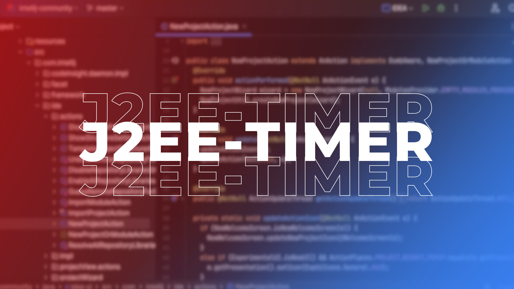

# 🚀 J2EE-Timer

## 📝 Project Overview

**J2EE-Timer** is a simple Java EE project that demonstrates how to schedule and manage timed tasks using EJB Timer Service. This project showcases both programmatic and automatic timer creation, making it a practical reference for understanding scheduled background processing in enterprise Java applications. The implementation covers stateless session beans, timer callbacks, and integration with servlets for task management—all following best practices for reliability and scalability.

---

## 📽️ Demo Video
[](https://youtu.be/kAnNUfUK1kY)

---

## 🗂️ Project Structure

```
J2EE-Timer/
├── src/
│   └── main/
│       ├── java/
│       │   └── lk.jlat.web.eetimer/
│       │       ├── ejb/
│       │       │   ├── remote/
│       │       │   ├── AutoTimerSessionBean
│       │       │   ├── TaskSessionBean
│       │       │   └── TimerSessionBean
│       │       ├── servlet/
│       │       │   ├── Task2
│       │       │   └── Test
│       │       └── timer/
│       │           └── Task
│       ├── resources/
│       └── webapp/
│           └── index.jsp
├── pom.xml
```

## **Modules & Key Files**

#### 🟦 ejb
- **AutoTimerSessionBean**  
  Handles automatic scheduling using `@Schedule` annotation for recurring tasks.

- **TaskSessionBean**  
  Demonstrates asynchronous task execution using a managed executor service.

- **TimerSessionBean**  
  Manages programmatic timers, calendar-based scheduling, timer callbacks (`@Timeout`), and timer cancellation.

##

#### 🟦 servlet
- **Test**  
  Servlet to trigger and schedule a new timer task via `TimerSessionBean`.

- **Task2**  
  Servlet to cancel an existing timer by referencing the scheduled task.

##

#### 🟦 timer
- **Task**  
  Serializable class representing a scheduled task's identity and metadata.

---

## ⚙️ How It Works

- ✅ **Automatic Timers:**  
  Use `@Schedule` in `AutoTimerSessionBean` to run methods at fixed intervals without manual intervention.

- ✅ **Programmatic Timers:**  
  `TimerSessionBean` creates timers dynamically using `TimerService`, schedules tasks, and handles timeout events with `@Timeout` methods.

- ✅ **Task Execution:**  
  `TaskSessionBean` leverages Java EE's managed executor service for asynchronous operations.

- ✅ **Servlet Integration:**  
  The `Test` servlet triggers new timers and stores task info in the session, while `Task2` cancels the timer based on task ID.

- ✅ **Persistence & Configuration:**  
  Maven-based project setup with Java 11 and Jakarta EE 10 dependencies for modern, portable deployment.

---

## ✨ Key Features

- ✅ Demonstrates both annotation-based and programmatic EJB timers
- ✅ Showcases timer callbacks and cancellation
- ✅ Integrates servlets for web-based task management
- ✅ Clean, modular code for easy learning and extension

---

## 🛠️ Technologies Used

- Java 11
- Jakarta EE 10 (EJB, Servlet)
- Maven

---

## 📚 Learning Outcomes

- ✅ Understand EJB Timer Service for scheduled and recurring tasks
- ✅ Learn to implement both automatic and programmatic timers
- ✅ Explore asynchronous processing in Java EE
- ✅ Gain hands-on experience with modular enterprise Java applications

---

## 🧑‍💻 Student & Course Details

**Course**: Birmingham City University BSc (Hons) Software Engineering - Top Up  
**Unit Name**: Business Component Development II  
**Unit ID**: JIAT/BCD II  
**Assignment ID**: JIAT/BCD II/EX/01  
**Institution**: Java Institute for Advanced Technology  
## 🧑‍💻 Student & Course Details

**Course**: Birmingham City University BSc (Hons) Software Engineering - Top Up  
**Unit Name**: Business Component Development II  
**Unit ID**: JIAT/BCD II  
**Assignment ID**: JIAT/BCD II/EX/01  
**Institution**: Java Institute for Advanced Technology  
